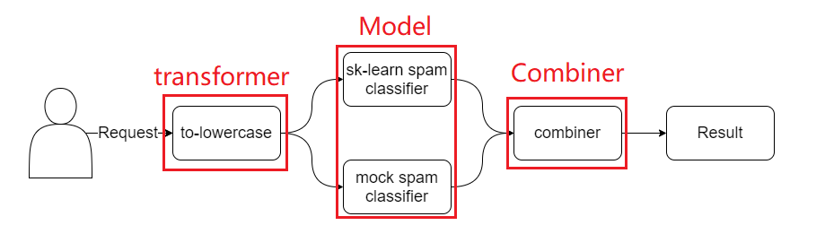

#### Model Deployment using Seldon Transformer + Combiner Component

僅更改image的Source Code，其餘使用均與官方範例相同，詳細請參考官方文件：
[https://github.com/SeldonIO/seldon-core/tree/master/examples/combiners/spam_clf_combiner](https://github.com/SeldonIO/seldon-core/tree/master/examples/combiners/spam_clf_combiner)

Inference Graph

The repository contains the folders for for each docker image needed for seldon graph to work. The images used for this example are already published in public dockerhub. So, deploy the model on k8s cluster using:

    kubectl apply -f deploy.yaml
